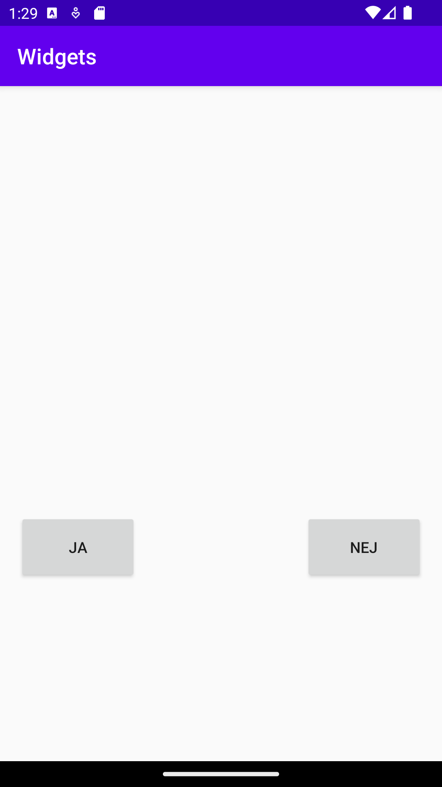

# Rapport

Det jag gjorde för denna uppgift var att jag skapade en ny constraint layout i filen "activity_main.xml"
under foldern "layout". Sedan skapade jag 3 stycken widgets/views i denna constraint layout. Dessa 3 var
en imageView och 2 buttons. Jag skapade 3 nya stings i filen "strings.xml" under foldern values där
jag skrev in vad som skulle stå i dom olika knapparna samt vad som skulle stå i contentDescription på
imageView widgeten. Jag constrainade sedan knapparna till botten av "parent" samt respektive 
start och end samt så konstrainade jag image viewn till toppen av "parent" samt start och end.
nedan är koden för en utan mina knappar
```
  <Button
      android:id="@+id/button"
      android:layout_width="111dp"
     android:layout_height="63dp"
      android:layout_marginStart="16dp"
      android:layout_marginLeft="16dp"
      android:layout_marginBottom="16dp"
      android:text="@string/buttonYes"
      app:layout_constraintBottom_toBottomOf="parent"
      app:layout_constraintStart_toStartOf="parent" />
```



